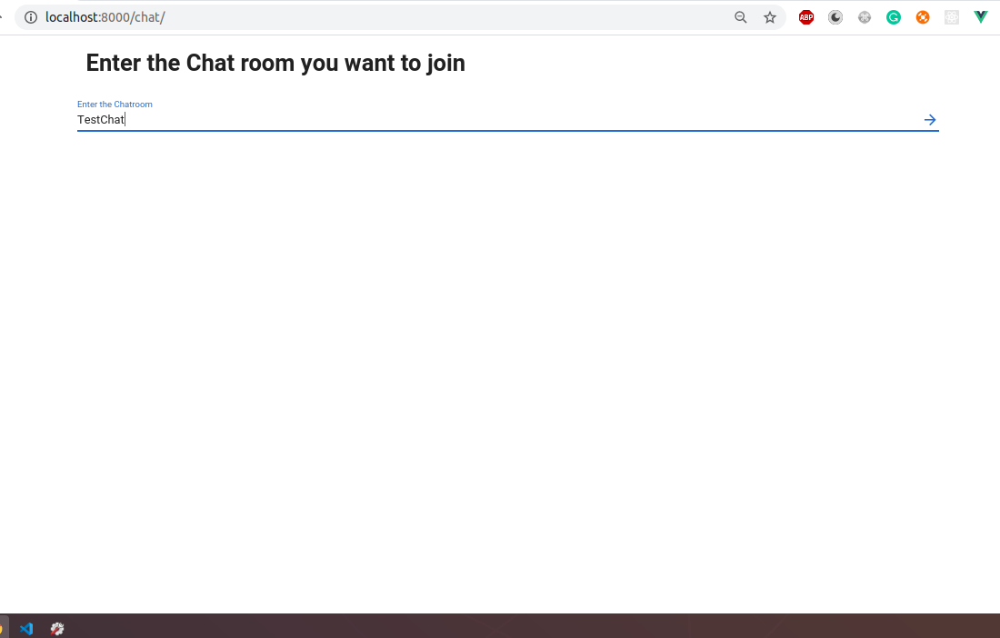
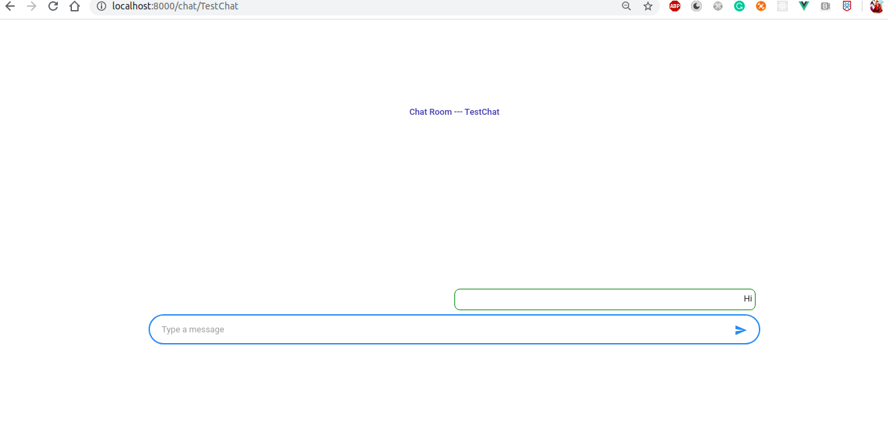
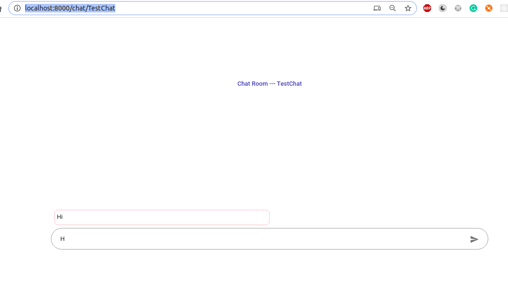

# Pixuate Challenge


> Implemented requirement with by doing chat room basis, which covers single and groups chat.
> I can improve a lot but not now as of challenge with given time.
> Find the images below for reference output

  

# Details and Urls!

  - run the django server with default 8000
  ```sh
$ pip install -r requirements.txt
$ python manage.py runserver
```
  - need to run redis container for channellayer using redis broker
 ```sh
$ docker run -d -p 6379:6379 redis
```
  - main url --> /chat/
>you can land to chat url and follow the instructions to enter the chat room,
do it with atleast 2 tabs so that communication establishment can be seen i.e chat

### References

Attaching the references

| Site | URL |
| ------ | ------ |
| Channels | https://channels.readthedocs.io/en/latest/ |
| VueJs | https://vuejs.org/ |
| Vuetify | https://vuetifyjs.com/en/introduction/why-vuetify/ |


### Images




